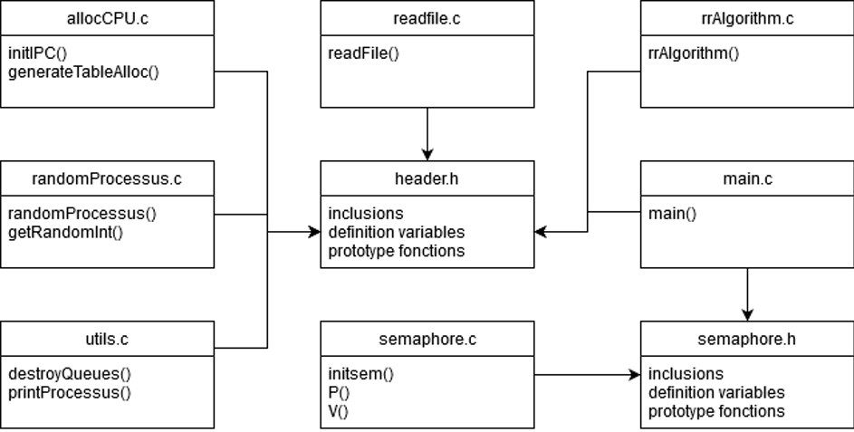

# Projet_Ordonnanceur_C
Projet d'ordonnanceur réalisé en C par @lripoche et @dmusy

## Lancement 
Il faut d'abord compiler le projet puis l'exécuter : 
```
make
./program
```

## Principe 

Ce projet a pour but d'imiter un ordonnanceur utilisant l'algorithme Round Robin. 

Un ordonnanceur est un mécanisme qui va gérer l'ordre d'exécution des processus. Il va allouer des quantums de temps procésseur à un processus le demandant. 

Il est possible de régler la période d'allocation à plusieurs quantum de temps. 

## L'algorithme 

Pour bien comprendre l'algorithme Round Robin il faut déjà définir un processus. 

Un processus est une tâche à exécuter qui possède un numéro d'identification (PID), une date de soumission (à quel quantum de temps la tâche a été soumise), un temps d'exécution (nombre de quantums de temps nécessaire à sa complétion) et un type que nous allons détailler plus tard. 

Ainsi l'algorithme est une boucle infinie qui consulter une queue des processus demandant du temps d'exécution. L'algorithme va chercher un processus dont le type est égal à la priorité courante. La priorité courante est un nombre allant de 0 à 10 et qui permet de traiter des processus en fonction de leur criticité. 

Une fois que l'algorithme a trouvé un processus il va réduire son temps d'exécution de la valeur du quantum de temps (ou de la période d'allocation), ceci correspond à son exécution. Si le temps d'exécution est égal à 0 alors le processus est considéré comme traité, sinon il est remis dans la queue avec un type élevé de 1. 

Ce mécanisme permet de traiter d'abord les processus récemment arrivés. Dans un système réaliste le type du processus est réglé en fonction de sa criticité pour le système. 

Une fois ceci fait, la priorité courante est incrémentée de 1.

## L'architecture 

### File de message
La queue est en réalité une file de message, une fonction va générer des processus aléatoires toutes les secondes et va les poster dans la file. Ensuite l'algorithme va parcourir cette file jusqu'à trouver un message avec le type recherché. 

### Threads et Semaphores

Pour pouvoir exécuter en simultané la création de processus aléatoires et l'algorithme Round Robin nous créons un thread pour chaque fonction. 

Ensuite, pour éviter que des processus aléatoires ne soient postés lorsque la file de message est parcourue par l'algorithme nous utilisons des semaphores. 

Lorsque un processus aléatoire vient d'être posté, on débloque la sémaphore 0 et on met la fonction en attente de la sémaphore 1. 
Dans le même temps va s'exécuter le thread de l'algorithme Round Robin, il va immédiatement se mettre en attente sur le sémaphore 0. Une fois le message envoyé par le thread de création de messages aléatoires, l'algorithme Round Robin va être débloqué et va pouvoir effectuer la réception d'un message. Au terme de cela, il va débloquer le sémaphore 1. Ainsi l'envoi et la réception sont synchronisés.

### Quelques fonctions détaillées 

initIPC : va créer une file de messages et stocker sa clé dans la variable id_queue. 

generateTableAlloc : va générer notre variable de table d'allocation à partir de notre table des itérations. Chaque entrée de la table d'itération correspond au nombre d'itérations de l'index. Par exemple, les 26 premières entrées de la table d'allocation seront des zéros. 

readfile : pour peupler la file de message au lancement du programme, nous avons créer un fichier dataset contenant les propriétés de plusieurs processus qui vont être immédiatement ajoutés à la file 

### Segmentation du code



